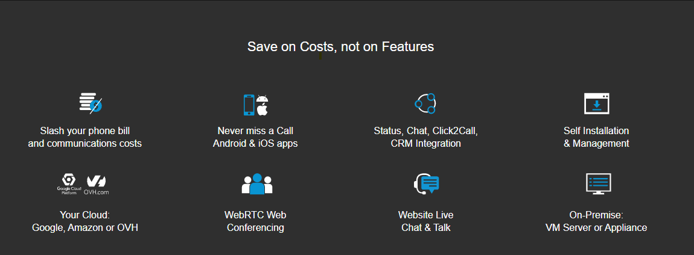

### 3CX Partners with G2IT for Perth, Fremantle & Esperance region

[3CX](https://www.3cx.com/?target=_blank) is an open standards communications solution that offers complete Unified Communications platform. Suitable for any business or industry, 3CX can accommodate every need; from mobility and status to advanced contact centre features and more, at a fraction of the cost.

G2IT technicians are 3CX certified and make installation, management and maintenance of your 3CX communications system effortless. Whether on-premise server or in the cloud, 3CX has got you covered. 
3CX has partnered with world leading phone manufacturers to create a seamless phone provisioning process and firmware patching to create a complete software lifecycle process. 3CX certified manufacturing partners include: Yalink, Fanvil, Grandstream, Htek, Snom and Intelbras. 3CX also provides “Legacy support with Limited Future Set” for Polycom, Avaya and Cisco.

### Why should I use 3CX for my business in Perth, Fremantle or Esperance?

**Installation & configuration is straightforward with:**

* plug & play interoperability of IP phones and gateways
* security features including automatic updates and global IP blacklist
* easy integration with leading SIP Trunk providers

**Deploy on-premise or in the Cloud:**

* Google, Microsoft Azure, OVH, Amazon Web Services, Amazon Lightsail and many more
* on an existing Windows or Linux machine
* MiniPC Appliance or Raspberry Pi!
* Virtualize and segregate on Hyper-V, VMware or KVM

**Security & Backup**

When it comes to VoIP security, 3CX sets the standard. 3CX’s inbuilt security has been exclusively developed to protect your PBX (Phone System) system from attacks. 

* Increased secure web server configuration
* Automatic detection & blacklisting of SIP Attack tools
* Global IP Blacklist automatically updated for participating PBXs
* Traffic to 3CX apps is encrypted via the 3CX Tunnel
* Voice traffic is encrypted via SRTP
* Automatic generation and management of SSL certs
* Revolutionary VoIP Security with A+ rating from SSL lab
* Automatic Failover for instant backup
* Encryption between browser and the website ensured via HTTPS
* Limit access to 3CX management console based on IP

**Reduce Telco Costs** 

By using 3CX, your ongoing telco cost savings will be reduced significantly and so will the cost of buying, expanding and maintaining your PBX (Phone System).

* Decrease your phone bill significantly
* Licensing based on number of simultaneous calls 
* Pay per PBX (Phone System)
* Free interoffice calls and branch calls
* Use prominent SIP trunks to reduce outbound call charges
* Reduce travel expenses with integrated web conferencing
* Use International DIDs & IP Telephony so customers can call in at competitive rates

**Features, features, features**

* 3CX apps on Android / iOS Devices
* Use with Windows & Mac Softphones
* User-friendly WebRTC Softphone
* Click to Call Extension for Chrome and Firefox
* 3CX Live Chat & Talk directly from your website
* Integrated Video Conferencing
* Advanced Call Center features

**What do I get with G2IT as your 3CX Partner in Fremantle & Esperance? **

* Reduced support cost
* Increased manageability of your systems
* One-stop-shop for IT support
* Perth based 
* Australian owned

[Get in touch](https://www.g2it.com.au/contact-us) with us on 1300 325 487 or connect on [Facebook](https://www.facebook.com/pg/G2.IT.Here.For.You/?target=_blank) and [LinkedIn](https://www.linkedin.com/company/14527738/?target=_blank).
