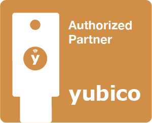
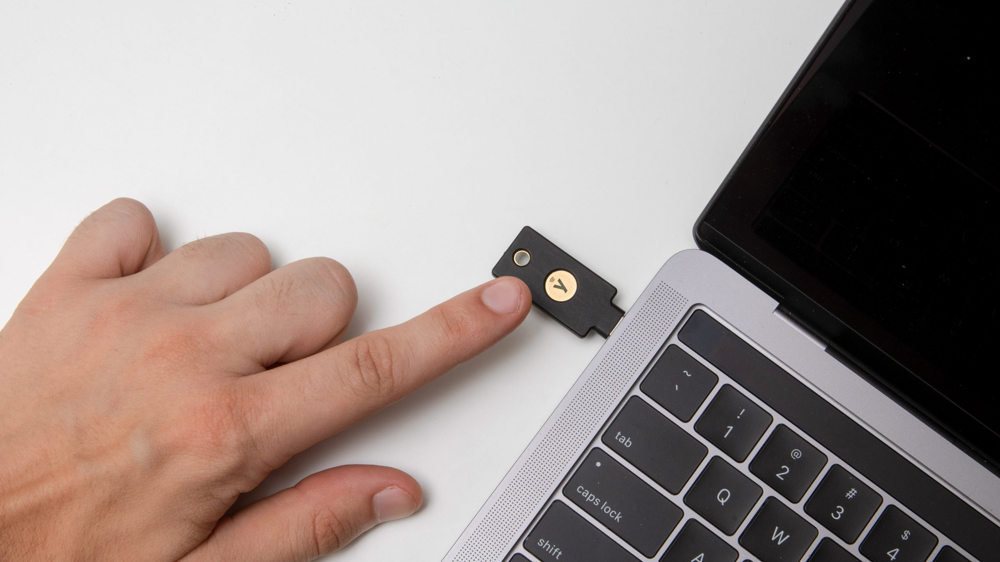

G2IT have established an exclusive partnership with Yubico and can provide hardware and set-up of YubiKeys.

&nbsp;

<h4 class="hero__headline" style="text-align: center;"><strong>YubiKey enables strong two-factor, multi-factor and passwordless authentication, protecting employees, customers and partners against phishing attacks.</strong></h4>

&nbsp;

Recent high-profile hacks exposed how a single breach can adversely affect a large number of industry and government agencies in one fell swoop. The average enterprise uses 288 applications, along with various on-premises and cloud infrastructures. If even a single hardware or software vendor in an organisation&rsquo;s supply chain gets hacked and effective security measures aren&rsquo;t in place, there&rsquo;s a high chance of a successful cyber attack.

Consequences can include business downtime or lost revenue, and also a breach of trust between the organisation and vendor.&nbsp;

While there is no silver bullet to prevent a cyber attack, there are many well established practices and technologies that can help ensure that organisations can compartmentalise any damage, detect breaches quickly, and respond and recover before the adversaries get too far.

&nbsp;

<h4 style="text-align: center;"><strong>YubiKeys Perth, Fremantle and Esperance, Western Australia</strong></h4>

&nbsp;

G2IT offer cyber security solutions that can help you rebuild trust. The YubiKey &ndash; an easy-to-use, phishing resistant hardware security key &ndash; secures access to IT systems and online services. We also offer the YubiHSM &ndash; a game changing hardware security module for cryptographic protection of servers, applications and computing devices &ndash; in an ultra portable nano form factor and at an affordable cost.

YubiKeys and YubiHSMs are produced in the USA and Sweden, maintaining security and quality control over the entire manufacturing process.

&nbsp;

&nbsp;

&nbsp;

<h1 class="hero__headline"> &nbsp;&nbsp;</h1>

&nbsp;

<a href="https://www.g2it.com.au/contact-us">Get in touch with G2IT</a>&nbsp;on 1300 325 487 or connect on&nbsp;<a href="https://www.facebook.com/pg/G2.IT.Here.For.You/" target="_blank" rel="noopener">Facebook</a>&nbsp;and&nbsp;<a href="https://www.linkedin.com/company/14527738/" target="_blank" rel="noopener">LinkedIn</a> to chat about your YubiKey requirements.
