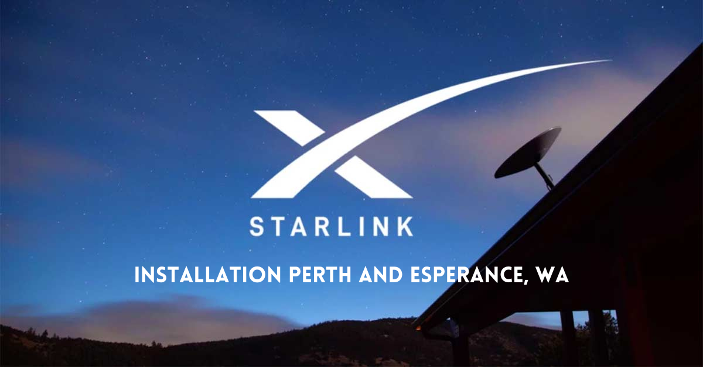
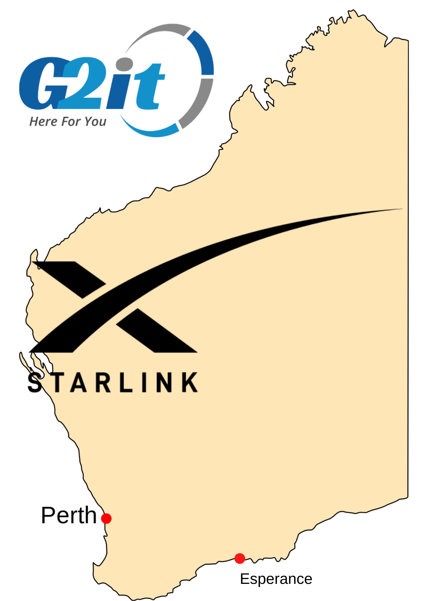

<h3 style="text-align: center;"><strong>Starlink Installation Perth, Margaret River &amp; Esperance, WA</strong></h3>

<a href="https://www.starlink.com/" target="_blank" rel="noopener">Starlink</a> provides high-speed, low-latency broadband internet across Western Australia. Starlink provides internet through a low earth orbiting satellite, and offers speeds of up to 150Mbps and very low latency.

Compared to other internet providers, Starlink can offer a lower latency, as SpaceX have been able to launch satellites orbiting the earth at approximately 550km. Traditional satellite internet providers have used satellites, orbiting at a much further distance of over 38,000km. As wireless signal is limited to the speed of light, this has left traditional services with a latency of over 600ms.

Due to having lower orbiting satellites, Starlink is thought to be able to provide significantly lower latencies and higher internet speeds. Starlink is predicted to be revolutionary for rural areas in Western Australia, such as Esperance and Margaret River.

Starlink installations in some rural towns in Queensland have already been able to achieve latencies close to the fixed line or fibre options available to more densely populated locations.

<strong>What we offer:</strong>

<ul>
<li>Starlink installation in Fremantle and surrounding suburbs</li>
<li>Starlink installation in Esperance and surrounding areas</li>
<li>Starlink installation in Margaret River and surrounding areas</li>
</ul>

<strong>What does Starlink installation Perth cost?</strong>

Every Starlink installation is tailor-made to suit individual residential or commercial requirements.

Get in touch with us to <a title="Starlink installation Perth, Margaret River, Esperance" href="https://www.g2it.com.au/contact-us">request a Starlink installation quote</a>.

<strong>What you get with a Starlink installation from G2IT:&nbsp;</strong>

<ul>
<li>One-stop-shop for IT support</li>
<li>Perth based cloud hosting</li>
<li>Fully Australian owned company</li>
</ul>

<a href="https://www.g2it.com.au/contact-us">Get in touch</a>&nbsp;with us on 1300 325 487 or connect on&nbsp;<a href="https://www.facebook.com/G2ITAustralia/" target="_blank" rel="noopener">Facebook</a>&nbsp;and&nbsp;<a href="https://www.linkedin.com/company/14527738/" target="_blank" rel="noopener">LinkedIn</a>.
