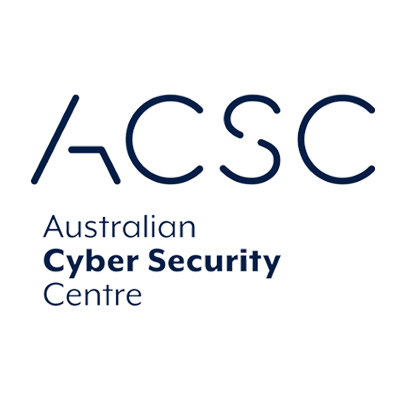

The Australian Cyber Security Centre (ACSC) has developed mitigation strategies to help organisations protect themselves against cyber-attacks.

<strong>G2IT can assist you with implementing the Essential Eight Maturity Model</strong>

The Essential Eight are designed to protect Microsoft Windows-based internet-connected networks but G2IT can develop mitigation strategies for businesses in Perth, Fremantle and Esperance using alternative systems.

They consist of eight security controls on three levels:

<ol>
<li><strong>Preventing attacks</strong>
<ol>
<li>Application control to prevent the use of unauthorised software</li>
<li>Patching applications to close security vulnerabilities</li>
<li>MS Office macro settings to block untrusted macros</li>
<li>Application hardening to protect against vulnerabilities</li>
</ol>
</li>
<li><strong>Limiting the extent of attacks</strong>
<ol>
<li>Restricting admin privileges to limit user access to systems</li>
<li>Patching operating systems to close security vulnerabilities</li>
<li>Multi-factor authentication to protect against hacked accounts (for example with <a href="https://www.g2it.com.au/our-partners/yubico">Yubico</a>)</li>
</ol>
</li>
<li><strong>Recovery</strong>
<ol>
<li>Backups to maintain the availability of critical data</li>
<li>Monthly, weekly, or daily schedule</li>
<li>Restoration of systems, software and data from backups is tested regularly</li>
</ol>
</li>
</ol>

Organisations are encouraged to achieve a maturity level that makes sense for the organisation&rsquo;s risk management level. To identify the required level, a <a href="https://www.g2it.com.au/our-services/network-and-security-assessments">risk audit and/or a cybersecurity audit</a> is required.

<strong>Which Maturity Level for my business? </strong>

How you achieve the Essential Eight Maturity Model for your business depends on the individual circumstances and business environment. A small restaurant has different needs compared to an offshore oil rig or public library. This is where G2IT can help.

<strong>Individual solutions to achieve the Essential Eight Maturity Model</strong>

Our qualified technicians can review your current business set-up, identify vulnerabilities, and provide solutions that are tailored to your circumstances and to your budget.

<strong>What do I get from working with G2IT?</strong>

<ul>
<li>Essential Eight level appropriate to your business&rsquo; needs</li>
<li>Reduced support cost through managed services agreements</li>
<li>Increased security, stability, and manageability of your systems</li>
<li>One-stop-shop for IT support and hardware</li>
<li>WA based with offices in Fremantle and Esperance</li>
<li>Australian owned</li>
</ul>

Get in touch with us to chat about YubiKeys, cyber security and all things IT: call 1300 325 487 or connect on <a href="https://www.facebook.com/G2ITAustralia/" target="_blank" rel="noopener">Facebook</a>&nbsp;and&nbsp;<a href="https://www.linkedin.com/company/14527738/" target="_blank" rel="noopener">LinkedIn</a>.
