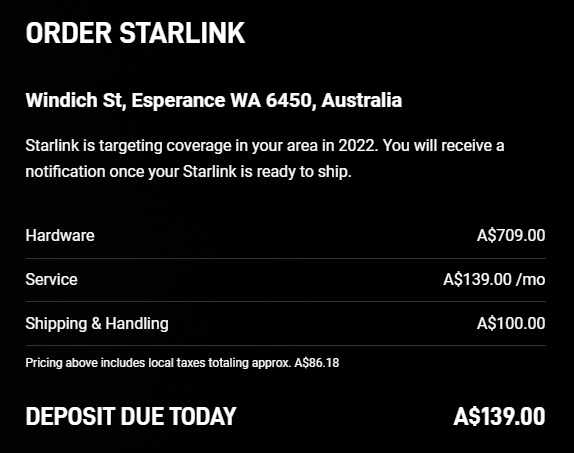

<strong></strong>

<strong>UPDATE 07.12.2021</strong>

Hooray! The first Starlink kits are being delivered to residential customers in Western Australia!&nbsp;

&nbsp;

<strong>UPDATE 03.11.2021</strong>

Have you signed up with or are you interested in getting Starlink satellite internet?

You could wait a bit longer...&nbsp;

The Starlink order web page has been updated with the following:

<blockquote>

Starlink is targeting coverage in your area in 2022. You will receive a notification once your Starlink is ready to ship.

</blockquote>

Stay tuned: Call 1300 325 487 or connect with us on <a href="https://www.facebook.com/G2ITAustralia/" target="_blank" rel="noopener">Facebook</a>&nbsp;and&nbsp;<a href="https://www.linkedin.com/company/14527738/" target="_blank" rel="noopener">LinkedIn</a>.

&nbsp;

<strong>Starlink Costs &amp; Speed&nbsp;</strong>

Starlink, the low-orbit satellite broadband service set up by Elon Musk's SpaceX company, will become available for Western Australian residents this year, with a tentative mid to late 2021 launch date.

The Starlink Kit will cost $709 with an added $100 for shipping and handling.

There are no data caps under the Starlink Beta program and the cost is set at $139 per month. Services and the Starlink Kit are for residential use only.

Users can expect to see data speeds vary from 50Mb/s to 150Mb/s and latency from 20ms to 40ms in most locations. As the Starlink system is still being enhanced over the next several months, there will also be brief periods of no connectivity at all.

&nbsp;

<strong>What's included in the Starlink Kit?</strong>

The Starlink Kit arrives with everything needed to get online, including the Starlink, Wi-Fi router, power supply, cables and mounting tripod. <a href="https://www.g2it.com.au/contact-us">G2IT can assist</a> with the installation and calibration of your Starlink system.

You can read more about Starlink Beta here: <a href="https://www.starlink.com/faq">https://www.starlink.com/faq</a>

&nbsp;

<strong>But wait, there's more!&nbsp;</strong>

The Starlink app (available for iOS and Android) is designed to:

<ul>
<li>Identify the install location that will ensure the best quality of service</li>
<li>Check for obstructions that can interfere with service</li>
<li>Setup your Starlink hardware</li>
<li>Verify your WiFi connection</li>
<li>Run speed tests</li>
<li>Troubleshoot connectivity issues</li>
<li>Contact support</li>
</ul>

&nbsp;

<iframe src="https://www.youtube.com/embed/pVm7sNRC6sE" width="560" height="315" frameborder="0" allowfullscreen="allowfullscreen"></iframe>

&nbsp;

<strong>Starlink is ideal for rural and remote communities</strong>

Starlink is ideally suited for remote areas of Western Australia, where connectivity has typically been a challenge.

Unbounded by traditional ground infrastructure, Starlink can deliver high-speed broadband internet to locations where access has been unreliable or completely unavailable.

G2IT can assist you with the installation and calibration of your Starlink system, so you can concentrate on other things. To discuss all things Starlink, get in touch with G2IT. Call 1300 325 487 or connect on <a href="https://www.facebook.com/G2ITAustralia/" target="_blank" rel="noopener">Facebook</a>&nbsp;and&nbsp;<a href="https://www.linkedin.com/company/14527738/" target="_blank" rel="noopener">LinkedIn</a>.
